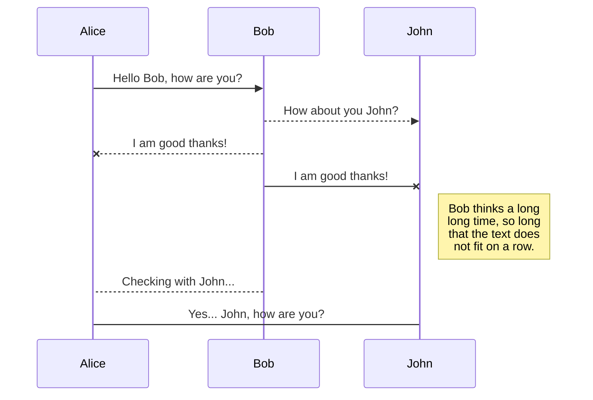
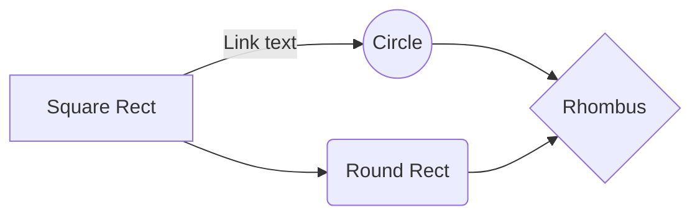

# BenchmarkPres

Here is a dotnet solution design to introduce benchmarkdotnet
All source code is based on the wonderful work of code-maze available at : 
https://code-maze.com/automapper-vs-mapster-dotnet/


# Perfomance measurment : The Old school way

**AutoMapperVsMapsterOldSchool.csproj** : this .net project is respsonsible of :
- Measure performance of three ways to map simple objects from DAO => DTO in .net 7. **(System.Diagnostics.StopWatch)**
- Report in console **(Console.WriteLine())**
- Serialize report **(System.IO.File)**

All is specific and can not be easily reused.

Pros : 
- Easy to create / run
Cons : 
- Hard to maintain
- Results are hard to interpret (all iteration return a different result especially the first one)
- Does not measure memory usage
- Reporting is very "raw"

Sample of reporting 
Pour OldSchool :10 données converties en 3978300 ns
Pour AutoMapper :10 données converties en 165635000 ns
Pour Mapster :10 données converties en 585700800 ns
---------------------------------------------------
Pour OldSchool :10 données converties en 8700 ns
Pour AutoMapper :10 données converties en 22100 ns
Pour Mapster :10 données converties en 10700 ns
---------------------------------------------------
Pour OldSchool :10 données converties en 4700 ns
Pour AutoMapper :10 données converties en 20400 ns
....


# Performance measurment : The Banchmarkdotnet way

**AutomapperVsMapster.Benchmark.csproj** : this .net project is responsible of :
- Measure performance of three ways to map simple objects from DAO => DTO in .net 7 and .net 6.0 **native**
- Report in console **native**
- Serialize report **native (html, csv etc..)**

Configuration used :
Benchmark on different OS 
```
[SimpleJob(RuntimeMoniker.Net70)]
[SimpleJob(RuntimeMoniker.Net60, baseline:true)]
```

Follow memory usage
```
[MemoryDiagnoser(true)]
```

Nothing is specific and can be easily maintained.


https://github.com/dotnet/BenchmarkDotNet

blabla ...stores you
r files in your browser, which means all your files are automatically saved locally and are accessible **offline!**


# TEST

StackEdit extends the standard Markdown syntax by adding extra **Markdown extensions**, providing you with some nice features.

> **ProTip:** You can disable any **Markdown extension** in the **File properties** dialog.


## UML diagrams

You can render UML diagrams using [Mermaid](https://mermaidjs.github.io/). For example, this will produce a sequence diagram:



And this will produce a flow chart:


