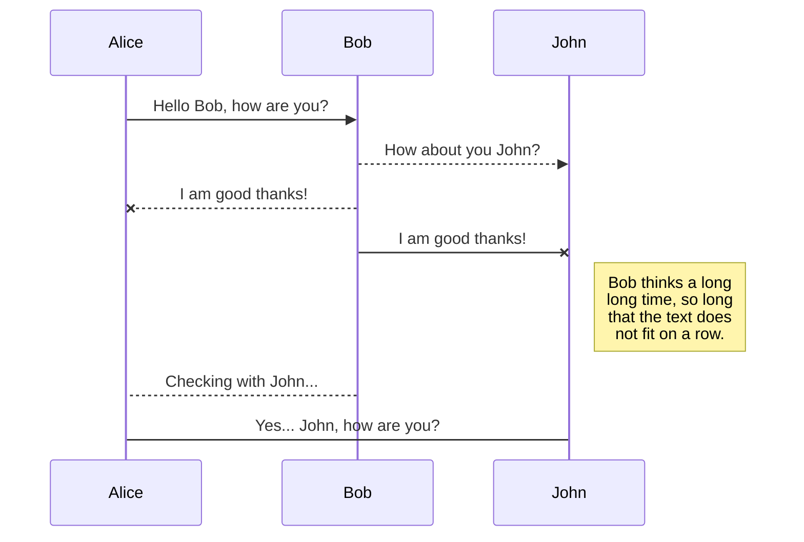
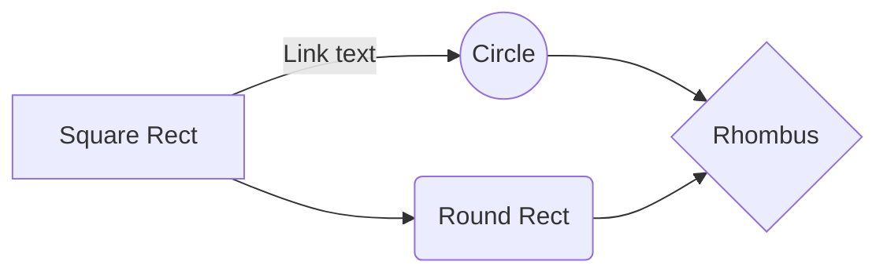

# BenchmarkPres

Here is a dotnet solution design to introduce benchmarkdotnet
All source code is based on the wonderful work of code-maze available at : 
https://code-maze.com/automapper-vs-mapster-dotnet/

# Perfomance measurment : The Old school way

Hi! I'm your first Markdown file in **StackEdit**. If you want to learn about StackEdit, you can read me. If you want to play with Markdown, you can edit me. Once you have finished with me, you can create new files by opening the **file explorer** on the left corner of the navigation bar.

# Performance measurment : The Banchmarkdotnet way

blabla ...stores your files in your browser, which means all your files are automatically saved locally and are accessible **offline!**

# TEST

StackEdit extends the standard Markdown syntax by adding extra **Markdown extensions**, providing you with some nice features.

> **ProTip:** You can disable any **Markdown extension** in the **File properties** dialog.

## UML diagrams

You can render UML diagrams using [Mermaid](https://mermaidjs.github.io/). For example, this will produce a sequence diagram:

And this will produce a flow chart:

